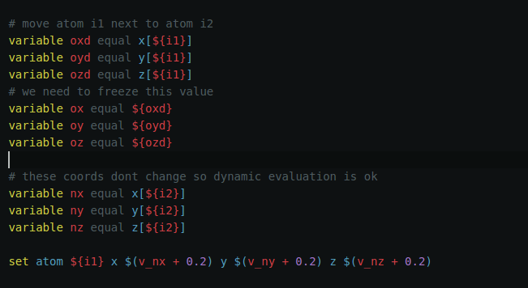

# LAMMPS language support Atom

Adds syntax highlighting and snippets to LAMMPS files in Atom.

_Example with Seti [UI](https://github.com/jesseweed/seti-ui) and [syntax](https://github.com/jesseweed/seti-syntax)_

If you have some feedback (bugs, enhancement, etc, etc...) please open an issue or just fork this repository and send a pull request.
